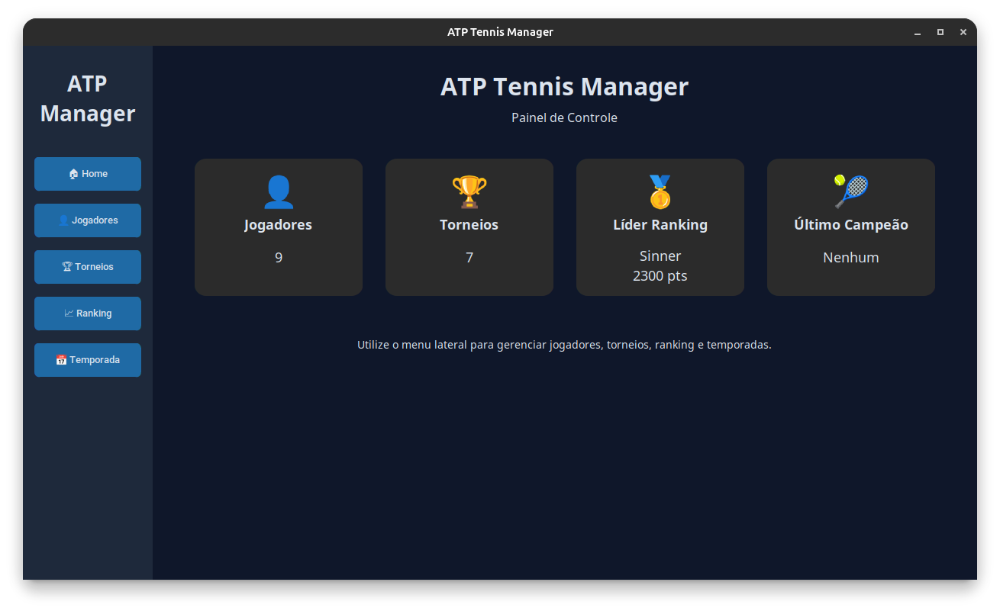

# ATP Tennis Manager

<p align="center">
  
</p>

Sistema de gerenciamento de temporada de tênis desenvolvido em **Python**, utilizando **Programação Orientada a Objetos (POO)**, **SQLite** e **CustomTkinter**.

O projeto simula uma temporada de tênis inspirada no circuito profissional, permitindo o gerenciamento de jogadores, torneios, partidas e ranking mundial por meio de uma interface gráfica.

> **Aviso:** Este projeto foi desenvolvido exclusivamente para fins acadêmicos e de aprendizado. Não possui qualquer vínculo, afiliação ou aprovação da ATP Tour ou de qualquer organização oficial do tênis profissional.

---

## Funcionalidades

- Cadastro de jogadores
- Edição e exclusão de jogadores
- Cadastro de torneios
- Inscrição de jogadores em torneios
- Simulação automática de partidas
- Simulação de torneios eliminatórios
- Atualização automática do ranking
- Histórico dos campeões
- Persistência de dados utilizando SQLite
- Interface gráfica desenvolvida com CustomTkinter

---

## Tecnologias utilizadas

- Python 3
- CustomTkinter
- SQLite
- Tkinter (Treeview)
- Programação Orientada a Objetos (POO)

---

## Estrutura do projeto

```text
tennis_manager_app/
│
├── database/
├── gui/
├── interfaces/
├── models/
├── utils/
├── main.py
└── README.md
```

---

## Como executar

1. Clone o repositório:

```bash
git clone https://github.com/vitorcoelho21/ATP_tennis_manager_desktop.git
```

2. Entre na pasta do projeto:

```bash
cd ATP_tennis_manager_desktop
```

3. Instale as dependências:

```bash
pip install customtkinter
```

4. Execute o projeto:

```bash
python main.py
```

---

## Interface

O sistema possui telas para:

- Home
- Gerenciamento de Jogadores
- Gerenciamento de Torneios
- Ranking Mundial
- Temporada

---

## Objetivo

Este projeto foi desenvolvido como trabalho da disciplina de **Programação Orientada a Objetos**, aplicando conceitos como:

- Encapsulamento
- Composição
- Agregação
- Modularização
- Persistência em banco de dados
- Interface gráfica
- Organização em camadas

---

## Autores

Projeto desenvolvido em dupla para a disciplina de **Programação Orientada a Objetos**.

- Vitor Coelho - https://github.com/vitorcoelho21
- João Paulo Pires - https://github.com/paulinpj
